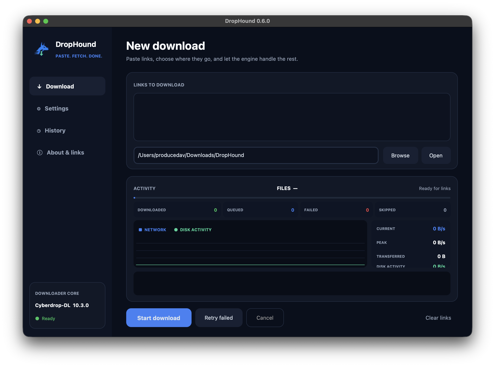

# DropHound — Bulk Image & Gallery Downloader


DropHound is a modern desktop interface for
[Cyberdrop-DL](https://github.com/Cyberdrop-DL/cyberdrop-dl). Paste links,
choose a destination, and follow live network and disk activity without using
a terminal.



## What is bundled

Release packages include:

- the DropHound desktop interface;
- a private Python runtime;
- `cyberdrop-dl-patched==10.3.0`;
- the dependencies and licenses needed by the application.

End users do **not** need Python, Git, Cyberdrop-DL, or command-line tools.
DropHound is the interface; the bundled Cyberdrop-DL engine performs the
downloads locally.

## Downloads

Download the package for your operating system from the GitHub Releases page.

| Platform | Package | Notes |
| --- | --- | --- |
| Windows 10/11 x64 | `DropHound-Setup-*.exe` | Standard installer |
| macOS Apple Silicon | `DropHound-*-macOS-arm64.dmg` | Drag the app to Applications |
| macOS Intel | `DropHound-*-macOS-x86_64.dmg` | Drag the app to Applications |
| Linux x86_64 | `drophound_*_amd64.deb` | Debian/Ubuntu installer |
| Linux x86_64 | `DropHound-*-Linux-x86_64.tar.gz` | Portable build |

The current community builds are not code-signed with paid Windows or Apple
developer certificates. Windows SmartScreen may ask for confirmation. On
macOS, Control-click DropHound, choose **Open**, then confirm the first launch.

## Features

- Multi-link downloads
- Pre-download image counts for one link or a complete multi-link batch
- Live completed/discovered file counter
- Separate downloaded, queued, failed, and skipped file counts
- Live download-throughput graph
- Disk-activity visualization
- Current and peak transfer speed
- Downloaded-data and elapsed-time counters
- Download history
- File-type filters
- Optional Netscape `cookies.txt`
- Retry and cancellation controls
- Native packages for Windows, macOS, and Linux
- In-app About page with the engine's current supported-site catalog

## Building from source

Building requires Python 3.12. End users installing a release do not need it.

### Windows

```powershell
Set-ExecutionPolicy -Scope Process Bypass
.\build.ps1
```

The installer is written to `installer-output`.

### macOS

```bash
./build_macos.sh
```

The DMG is written to `release`.

### Linux

Install Tk development support first. On Debian or Ubuntu:

```bash
sudo apt-get install python3-tk
./build_linux.sh
```

The `.deb` and portable archive are written to `release`.

## Automated releases

The GitHub Actions workflow builds and tests all three platforms. Pushing a tag
such as `v0.6.2` publishes the generated packages as a GitHub Release.

## Application data

| Platform | DropHound settings and history |
| --- | --- |
| Windows | `%APPDATA%\DropHound` |
| macOS | `~/Library/Application Support/DropHound` |
| Linux | `${XDG_CONFIG_HOME:-~/.config}/DropHound` |

Downloads default to `~/Downloads/DropHound`.

## License and responsible use

DropHound is GPL-3.0-only. Cyberdrop-DL is GPL-licensed and its copyright and
license notice is included in `licenses`.

Only download material you own or have permission to save. DropHound does not
grant rights to third-party content or remove your responsibility to follow
website terms and applicable law.
